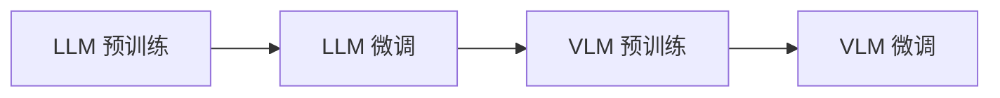

# 从 0 到 VLM 🚀

> 从零开始手写实现 LLM 到 VLM 的完整演进之路

[](https://python.org)
[](https://pytorch.org)
[](https://huggingface.co/docs/transformers)
[](LICENSE)

从一个最简单的 LLM 开始（多头自注意力 + 前馈神经网络），通过迭代演进的方式，逐步实现 Flash Attention、GQA、DeepSeek MLA、MoE 等先进架构，最终扩展为支持多模态的 VLM。

---

## ✨ 特性一览

### 🔄 架构演进路线

| 组件 | 演进路径 |
|------|----------|
| **注意力机制** | MHA → Flash Attention → GQA → DeepSeek MLA |
| **前馈网络** | MLP → SwiGLU → MoE → 共享专家 MoE → DeepSeek 隐式辅助损失 MoE |
| **训练流程** | 手写训练循环 → Transformers Trainer |
| **分词器** | 字符级 → BPE (Hugging Face Tokenizers) |
| **多模态** | LLM + 视觉投影层 → VLM |

### 📦 核心模块

- **`src/model/backbone/`** - 注意力机制、MoE、RoPE/YaRN、Transformer 块
- **`src/data/`** - 数据采样、清洗、预处理、分词器训练
- **`src/training/`** - 自定义 DynamicTrainer
- **`src/utils/`** - 推理工具

---

## 🚀 快速开始

### 环境要求

```bash
# 核心依赖
torch >= 2.6.0
transformers >= 4.57.0
numpy >= 2.0.0
```

### 安装依赖

```bash
pip install -r requirements.txt
```

### 一键训练（从 0 到 VLM）

```bash
python scripts/train_from_scratch.py
```

> ⚠️ **警告**：此脚本会删除 `logs/`、`models/` 和已处理的数据。如需保留数据，请注释掉 `delete_data()` 调用。

---

## 📁 项目结构

```
vv/
├── configs/
│   └── model.py              # 模型配置 (VVConfig, VisualVVConfig)
├── scripts/
│   └── train_from_scratch.py # 完整训练流水线
├── src/
│   ├── data/
│   │   ├── database/         # 原始数据集 (git-ignored)
│   │   ├── dataset/          # 预处理数据 (git-ignored)
│   │   ├── metadata/         # 采样清洗数据 (git-ignored)
│   │   ├── tools/            # 数据工具
│   │   ├── dataset.py
│   │   ├── preprocess.py
│   │   ├── preprocess_vlm.py
│   │   └── tokenizer.py
│   ├── model/
│   │   ├── backbone/
│   │   │   ├── attention.py  # MHA/GQA/MLA
│   │   │   ├── moe.py        # SparseMoE/HybridMoE
│   │   │   ├── rope.py       # RoPE/YaRN
│   │   │   ├── transform.py  # Transformer 块
│   │   │   └── vision.py     # 视觉编码器
│   │   ├── model_llm.py
│   │   └── model_vlm.py
│   ├── training/             # 自定义 Trainer
│   ├── utils/                # 推理工具
│   └── train.py              # 训练入口
├── tests/                    # 单元测试
├── models/                   # 模型输出 (git-ignored)
├── logs/                     # TensorBoard 日志 (git-ignored)
├── requirements.txt
└── readme.md
```

---

## 📊 训练流程

### 四阶段训练



| 阶段 | 模式 | 说明 |
|------|------|------|
| 1 | `pretrain`, `is_vlm=False` | LLM 预训练（从头开始） |
| 2 | `finetune`, `is_vlm=False` | LLM 微调（加载阶段 1 权重） |
| 3 | `pretrain`, `is_vlm=True` | VLM 预训练（冻结 LLM） |
| 4 | `finetune`, `is_vlm=True` | VLM 微调（解冻全部参数） |

### 单阶段训练

```python
from src.train import train

# LLM 预训练
train(mode='pretrain', is_vlm=False, num_train_epochs=1, eval_steps=500, save_steps=500)

# LLM 微调
train(mode='finetune', is_vlm=False, num_train_epochs=1, eval_steps=500, save_steps=500)

# VLM 预训练
train(mode='pretrain', is_vlm=True, num_train_epochs=1, eval_steps=500, save_steps=500)

# VLM 微调
train(mode='finetune', is_vlm=True, num_train_epochs=1, eval_steps=500, save_steps=500)
```

### 监控训练

```bash
tensorboard --logdir logs
```

---

## 📥 数据集准备

### 推荐数据集

**Minimind 数据集**（数据量适中，推荐入门）：

```bash
pip install modelscope

# 预训练数据
modelscope download --dataset gongjy/minimind_dataset pretrain_hq.jsonl --local_dir ./src/data/database/

# SFT 数据
modelscope download --dataset gongjy/minimind_dataset sft_512.jsonl --local_dir ./src/data/database/
```

**Minimind-V 数据集**（VLM 部分）：

```bash
modelscope download --dataset gongjy/minimind-v_dataset files --local_dir ./src/data/database/
```

### 一键下载脚本

```bash
python src/data/tools/download_dataset.py
```

### 其他数据集来源

| 数据集 | 链接 |
|--------|------|
| 流萤指令微调 | [Firefly Train 1.1M](https://huggingface.co/datasets/YeungNLP/firefly-train-1.1M) |
| 多轮对话 | [Multiturn Chat 0.8M](https://huggingface.co/datasets/erhwenkuo/multiturn_chat_0.8m-chinese-zhtw) |
| WuDao | [High Data](https://huggingface.co/datasets/mdokl/WuDaoCorpora2.0-RefinedEdition60GTXT) |

---

## 🔧 常见问题

### CUDA 错误调试

```bash
export CUDA_LAUNCH_BLOCKING=1
export TORCH_USE_CUDA_DSA=1
```

### 显存优化

项目已配置显存优化：
```bash
export PYTORCH_CUDA_ALLOC_CONF=max_split_size_mb:128
```

### BF16 支持

- **Ampere+ (compute capability >= 8)**: 自动启用 BF16
- **旧架构**: 使用 FP16

---

## 📚 模型配置

### VVConfig 核心参数

```python
@dataclass
class VVConfig:
    vocab_size: int = None
    hidden_dim: int = 576
    n_layer: int = 12
    n_head: int = 6
    n_kv_head: int = 3          # GQA/MLA
    max_seq_len: int = 512
    
    # MLA 配置
    kv_lora_rank: int = 128
    q_lora_rank: int = 96
    qk_rope_head_dim: int = 32
    
    # MoE 配置
    num_experts: int = 4
    num_experts_per_tok: int = 1
    num_shared_experts: int = 1
    
    # RoPE/YaRN
    rope_base: float = 10000.0
    rope_scale: float = 1.0
```

---

## 🙏 致谢

感谢以下优秀项目的启发：

- [LLMs-Zero-to-Hero](https://github.com/bbruceyuan/LLMs-Zero-to-Hero)
- [Minimind](https://github.com/jingyaogong/minimind)
- [My_LLM](https://github.com/REXWindW/my_llm)

---

## 📄 许可证

MIT License

---

<div align="center">

**如果这个项目对你有帮助，欢迎给一个 ⭐️ Star！**

</div>
